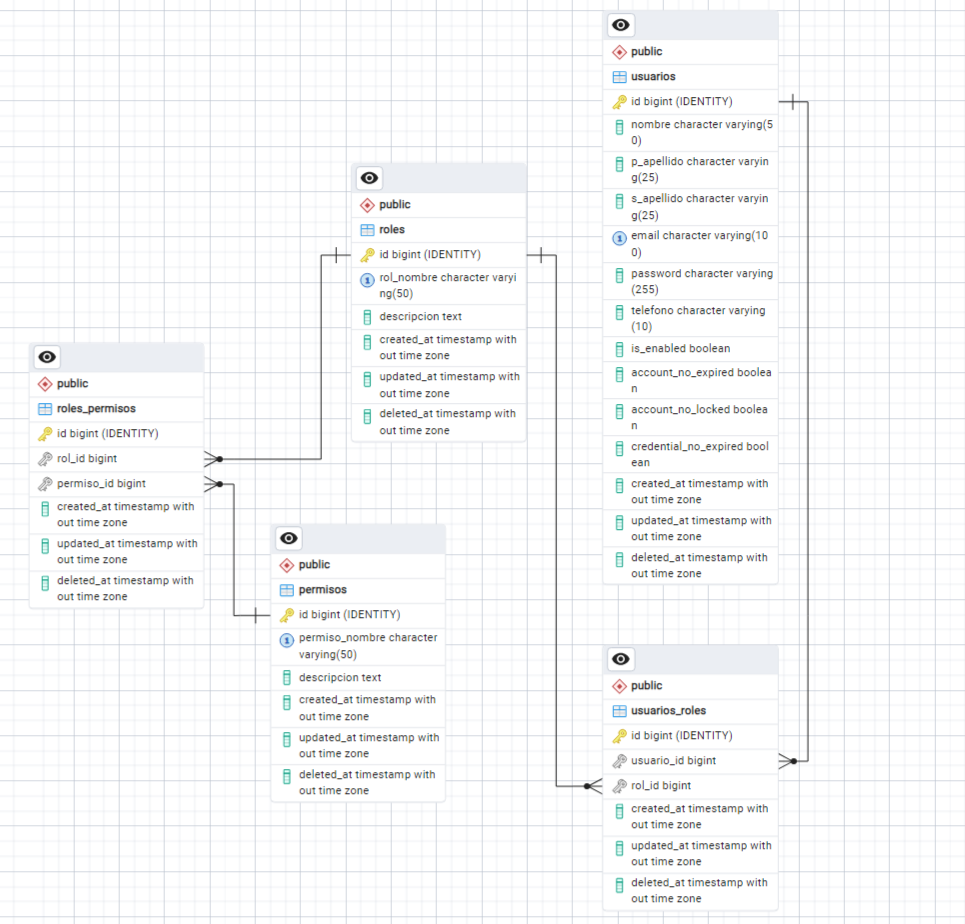

# 📉 ChurnInsight – Propuesta POC MVP

**Propuesta de modelo funcional para el proyecto ChurnInsight**

Propuesta enfocada en la colaboración para el sistema ChurnInsight, basada en un desarrollo incremental mediante ajustes, cambios y variantes, promoviendo una forma de trabajo iterativa orientada al bien común del proyecto.
 
- Los avances se documentan de forma progresiva, permitiendo consultar cada ajuste realizado, junto con su respectiva justificación técnica.


# 📋 Índice

**Implementaciones**
-  [📦 README Original "Compañero Alex" ](#churninsight--guía-de-configuración-inicial)
 
### Commit "POC MVP: initial project setup (layers, Lombok, H2)"

- [📦 Ajustes de estructura del proyecto ](#-ajustes-de-estructura-del-proyecto)
-  [📈 Implementacion "LOMBOK" y ajuste "POM""](#-implementación-de-lombok-y-ajustes-en-pom)
-  [📁 Ajustes de configuración (YAML y perfiles)](#-ajustes-de-configuración-yaml-y-perfiles)

### Commit "POC MVP: integración predict lista para mocks"
-  [📦 Ajustes de "ENUMS" estructura del proyecto ](#-ajustes-de-enums-estructura-del-proyecto)
- [👤 Modelo Cliente y contratos de datos inmutables](#-modelo-cliente-y-contratos-de-datos-inmutables)
- [🔮 Flujo de Predicción: Controller, Service y Client](#-flujo-de-predicción-controller-service-y-client)

### Commit "flujo completo de predicción de churn y limpieza de servicios de prueba"

- [🧪 Robustecimiento del MVP: normalización de contratos, serialización y manejo de errores](#-flujo-de-predicción-controller-service-y-client)
- [🧩 Cambio 1: Normalización del contrato externo sin romper el dominio](#-cambio-1-normalización-del-contrato-externo-sin-romper-el-dominio)
- [🧪 Cambio 2: Flujo MVP preparado para mocks y evolución del modelo DS](#-cambio-2-flujo-mvp-preparado-para-mocks-y-evolución-del-modelo-ds)
- [🛡️ Cambio 3: Manejo centralizado de errores y validaciones](#-cambio-3-manejo-centralizado-de-errores-y-validaciones)


---

# 🧪 Robustecimiento del MVP: normalización de contratos, serialización y manejo de errores

**Se realizaron ajustes estructurales y de infraestructura enfocados en estabilizar el MVP funcional, priorizando la fiabilidad del modelo, la tolerancia a variaciones del contrato externo y una mejor experiencia de error para pruebas e integración con el modelo de Data Science.**

**Este commit consolida decisiones técnicas necesarias para continuar el desarrollo del modelo sin depender del estado actual del equipo de DS.**

## 🧩 Cambio 1: Normalización del contrato externo sin romper el dominio

### Se fortaleció la tolerancia del sistema ante contratos inconsistentes o variables provenientes del exterior, manteniendo un dominio interno confiable y tipado.

## Decisiones clave:

- El dominio sigue trabajando con booleanos reales (Boolean).
- El contrato externo acepta múltiples representaciones:
  - "Yes" / "No"
  - "1" / "0"
  - "true" / "false"
  - Variantes como "si", "y", etc.
- La conversión se realiza en la capa de serialización, no en el dominio.
- **Qué se hizo:**
  - Se incorporaron deserializadores personalizados (YesNoToBooleanDeserializer).
  - Se incorporaron serializadores específicos para enviar datos al modelo DS:
    - Boolean → Yes / No 
    - Boolean → 1 / 0
- Se estandarizó el uso de @JsonCreator en enums para tolerar variaciones de formato (spaces, -, mayúsculas).
### 👉 Resultado:
**El dominio queda limpio, consistente y estable, aunque el contrato externo no lo sea.**


## [📋 Volver al índice ☝️](#-índice)

--- 

## 🧪 Cambio 2: Flujo MVP preparado para mocks y evolución del modelo DS

**Se ajustó el flujo de integración con el servicio de predicción para garantizar continuidad del desarrollo, aun cuando el modelo DS no esté disponible o no responda.**

### Decisiones clave:

- El MVP no depende del estado del equipo DS para avanzar.

- Se mantiene un cliente de integración único (DsPredictClient).

- El flujo de predicción sigue siendo lineal y explícito.

- **Qué se hizo:**

  - Se apuntó el cliente a un endpoint mock/local para pruebas.

  - Se mantuvo la separación clara entre:

    - Controller (entrada)

    - Service (orquestación)

    - Client (integración)

  - Se eliminaron servicios y clases de prueba temporales ya obsoletas.

### 👉 Resultado: 
 - **El MVP sigue funcionando, evolucionando y siendo validable sin bloqueos externos.**

## [📋 Volver al índice ☝️](#-índice)

--- 
## 🛡️ Cambio 3: Manejo centralizado de errores y validaciones

**Se incorporó un manejo global de excepciones para mejorar la claridad de errores durante pruebas y consumo del endpoint.**

### Decisiones clave:

- Los errores deben ser explícitos y accionables.
- Se evita exponer stacktraces innecesarios.
- Se centraliza el manejo de errores como preocupación transversal.
- **Qué se hizo:**

  - Se agregó un GlobalHandlerException.

  - Se manejan explícitamente:
  - Errores de JSON mal formado

  - Valores inválidos en enums o booleanos

  - Errores de validación (@Valid)

 - Se devuelve información clara sobre:

   - Campo

   - Valor inválido

   - Motivo del error

### 👉 Resultado:
### **Mejor experiencia de prueba, debugging más rápido y contratos más claros.**

## 🎯 Objetivo del ajuste

**Permitir que el desarrollo continúe de forma independiente, asegurando un modelo interno sólido, contratos tolerantes y un MVP estable, aun cuando las integraciones externas no estén listas o sean cambiantes.**

## 🍱 Beneficio

- Dominio confiable y tipado

- Contratos flexibles sin contaminar el modelo

- MVP estable para pruebas y evolución

- Menos fricción en integración

- Base preparada para histórico de predicciones

# 🧱 Impacto técnico

### - **Este commit introduce complejidad solo en las capas de infraestructura, de forma controlada y consciente.**
### - **No se altera la lógica de negocio ni el flujo funcional del MVP; se refuerza su estabilidad y capacidad de evolución.**

## [📋 Volver al índice ☝️](#-índice)

---

# 🔮 Flujo de Predicción: Controller, Service y Client

**Se consolidó el flujo completo de predicción de churn a través de una arquitectura clara y lineal que conecta controlador, servicio y cliente de integración, eliminando componentes temporales y estandarizando el punto de entrada del sistema.**

**Este ajuste formaliza el camino real de la predicción dentro del MVP y prepara la base para pruebas controladas con servicios mockeados.**

## 🔹 Cambios realizados

- Se definió PredictController como único punto de entrada HTTP para predicciones.
- Se consolidó PredictService como orquestador del flujo de negocio.
- Se integró DsPredictClient como cliente dedicado para el consumo del servicio de predicción.
- Se eliminó el controlador de pruebas (PruebaController) al no ser necesario en el flujo MVP.
- Se eliminó el wrapper genérico ApiResponse para simplificar el contrato de respuesta.
- Se estandarizó el flujo para trabajar directamente con DTOs de dominio.

## 🌐 PredictController (capa de entrada)

### Responsabilidad:

- Exponer el endpoint /predict.
- Recibir el contrato de entrada validado.
- Delegar completamente la lógica al servicio.
### Decisión clave:
- El controlador no contiene lógica de negocio ni transformación de datos.
- Su función es actuar como frontera clara entre el mundo externo y el dominio interno.
- **👉 Esto refuerza el principio de controller delgado.** 

## 🧠 PredictService (orquestación del dominio)

### Responsabilidad:

- Coordinar el flujo completo de predicción.
- Construir la entidad Cliente a partir del DTO de entrada.
- Invocar al cliente de predicción.
- Enriquecer la entidad con los resultados obtenidos.
- Construir el DTO de salida.

### Decisiones importantes:

- El servicio actúa como punto central del caso de uso, no como contenedor de reglas aisladas.
- La entidad Cliente se utiliza como modelo interno confiable.
- El flujo se mantiene lineal y explícito, favoreciendo legibilidad sobre abstracción prematura.

👉 En esta fase MVP, se prioriza claridad y trazabilidad del flujo.

## 🔌 DsPredictClient (integración externa / mock)

### Responsabilidad:

- Encapsular completamente la comunicación con el servicio de predicción.
- Aislar al dominio de detalles HTTP y configuración externa.
- Decisiones clave:
- Uso de RestClient como cliente HTTP moderno.
- Inyección de la URL vía configuración (mock.service.url).
- Validación temprana de configuración para evitar errores silenciosos.
- Manejo explícito de errores de integración.

👉 Este cliente está preparado tanto para mocks como para un modelo real de Data Science.

## 🧹 Eliminaciones 
### **❌ PruebaController**

El flujo MVP queda centralizado y controlado.

### **❌ ApiResponse**

- Eliminado para reducir capas innecesarias.
- Se prioriza claridad del contrato sobre envoltorios genéricos.
- Facilita pruebas y consumo del endpoint.

## 🎯 Objetivo del ajuste

**Formalizar un flujo de predicción único, claro y desacoplado, eliminando componentes temporales y asegurando que cada capa tenga una responsabilidad bien definida dentro del MVP.**

## 🍱 Beneficio

- Flujo de predicción explícito y trazable
- Menos ruido estructural
- Mejor separación de responsabilidades
- Preparación natural para tests y mocks
- Arquitectura lista para evolucionar

## 🧱 Impacto técnico

Este ajuste no introduce nuevas reglas de negocio ni cambia el comportamiento funcional del MVP.
Su impacto es estructural: ordena el flujo real de predicción, reduce ambigüedad y consolida una arquitectura más fiable para iteraciones futuras.

## [📋 Volver al índice ☝️](#-índice)


---


# 👤 Modelo Cliente y contratos de datos inmutables

** Se definió la entidad Cliente junto con un conjunto de DTOs inmutables que actúan como contratos de datos para los distintos flujos de predicción y consulta de churn, con el objetivo de separar el modelo de dominio de los datos de intercambio y evitar mutaciones innecesarias.

Este ajuste refuerza la claridad del dominio y establece una base segura para integraciones, pruebas con mocks y evolución del sistema.**

### Cambios realizados:

- Se consolidó la entidad Cliente como representación central del dominio.
  - se consideró el Json Contrato definido por el equipo de "DS"  


```
Leandro Puebla Martínez
29/12/2025 20:44

INPUT:

{

    "id_cliente": "7590-VHVEG",
    "genero": "Male",
    "adulto_mayor": 0,
    "tiene_pareja": "Yes",
    "tiene_dependientes": "No",
    "antiguedad_meses": 12,
    "servicio_telefono": "Yes",
    "lineas_multiples": "No",
    "servicio_internet": "Fiber optic",
    "seguridad_en_linea": "No",
    "respaldo_en_linea": "Yes",
    "proteccion_dispositivo": "No",
    "soporte_tecnico": "No",
    "streaming_tv": "Yes",
    "streaming_peliculas": "Yes",
    "tipo_contrato": "Month-to-month",
    "facturacion_electronica": "Yes",
    "metodo_pago": "Electronic check",
    "cargo_mensual": 85.5,
    "cargos_totales": 1026.0

}

OUTPUT:

{

    "id_cliente": "7590-VHVEG",
    "prevision": "Va a cancelar",
    "abandono_cliente": true,
    "probabilidad": 0.732

}
```

- Se definieron DTOs específicos para cada caso de uso relacionado con churn y predicción.
- Se implementaron los DTOs como interfaces inmutables, evitando estado modificable.
- Se separó claramente el modelo de dominio de los contratos de entrada y salida.
- Se alinearon los DTOs con los enums del dominio para mantener consistencia.
- Se organizó la estructura bajo un paquete cliente, con un subpaquete dto.

### DTOs incluidos:

- DatosObtenerPrediccionCliente: 
  - Representa la información mínima necesaria para solicitar una predicción.
- DatosDsPredict
  - Modela la respuesta proveniente del sistema de predicción.
- DatosConsultaChurnCliente 
  - Define los datos requeridos para consultar el estado churn de un cliente. 
- DatosDetalleChurnCliente
  - Modela la respuesta al client de "CLIENTE" incluyendo la respuesta del DS.

### Objetivo del ajuste:

Establecer contratos de datos claros, explícitos e inmutables que desacoplen el dominio interno de las integraciones externas y reduzcan el riesgo de errores por mutabilidad o reutilización incorrecta de modelos.

## 🍱 Beneficio:

- Separación clara de responsabilidades

- Contratos de datos explícitos y predecibles

- Menor acoplamiento entre capas

- Facilidad para mocks y pruebas

- Base sólida para validaciones futuras

## 🧱 Impacto técnico:

Este ajuste no introduce lógica adicional ni altera el comportamiento funcional del sistema. Su impacto es estructural y conceptual, orientado a mejorar la mantenibilidad, legibilidad y estabilidad del modelo conforme el proyecto evolucione.


## [📋 Volver al índice ☝️](#-índice)

---


# 📦 Ajustes de ENUMS y estandarización de valores de dominio

**Se realizó la creación y estandarización de los ENUMS del dominio, con el objetivo de representar de forma explícita los valores permitidos en el sistema y evitar el uso de strings o valores ambiguos provenientes del contrato externo.** 

**Estos cambios no alteran el comportamiento funcional, pero sí fortalecen la consistencia del modelo de dominio y preparan la base para validaciones más estrictas y evolución futura del proyecto.**

## 🔧 Cambios realizados

- Se creó el paquete enums para centralizar los valores categóricos del dominio.

- Se definieron los siguientes ENUMS:

  - Genero → MALE, FEMALE, OTHER

  - MetodoPago → ELECTRONIC_CHECK, BANK_TRANSFER, CREDIT_CARD

  - ServicioInternet → FIBER_OPTIC, DSL, NONE

  - TipoContrato → MONTH_TO_MONTH, ONE_YEAR, TWO_YEAR

- Se integraron los ENUMS en:

  -La entidad Cliente

  -El DTO DatosConsultaChurnCliente

- Se utilizó @Enumerated(EnumType.STRING) para:

  - Persistir los valores como texto en base de datos

  - Evitar problemas ante cambios de orden en los ENUMS

## 🎯 Objetivo del ajuste

- Evitar valores inválidos o inconsistentes en el dominio

- Desacoplar el modelo interno de representaciones externas (JSON / DS)

- Facilitar validaciones, mantenimiento y refactorizaciones futuras

- Preparar el dominio para reglas de negocio más claras

## 🍱 Beneficios

- Mayor claridad semántica del modelo

- Menor riesgo de errores por valores mágicos

- Dominio más expresivo y auto-documentado

- Base sólida para validaciones y mapeos futuros

# 🧱 Impacto técnico

**Estos ajustes no agregan nuevas funcionalidades ni cambian el flujo actual.**
**Su propósito es fortalecer el modelo de dominio, reducir ambigüedad y prevenir deuda técnica desde etapas tempranas del desarrollo.**

## [📋 Volver al índice ☝️](#-índice)

---

---

# 📁 Ajustes de configuración (YAML y perfiles)


**Se realizaron ajustes en la configuración del proyecto para separar los entornos de ejecución y facilitar el desarrollo del MVP, sin modificar la lógica de negocio ni el comportamiento funcional del sistema.**

### Cambios realizados

- Separación de la configuración en múltiples archivos YAML según el entorno.
- Definición de un archivo application.yml base con configuración común.
- Activación del perfil h2 como entorno por defecto para el MVP.
- Creación de un archivo application-h2.yml para configuración de base de datos en memoria.
- Habilitación de la consola H2 para facilitar pruebas y validación de datos.
- Separación de la configuración de PostgreSQL en un archivo independiente.
- Mantenimiento de la configuración original de PostgreSQL para futuras etapas del proyecto.
- Centralización del nivel de logging en la configuración base.

### 🎯 Objetivo del ajuste

Permitir un cambio controlado entre entornos de desarrollo y persistencia sin modificar código, reducir fricción durante el desarrollo inicial y preparar el proyecto para una configuración más robusta en etapas posteriores.

### 🧱 Impacto técnico

Estos ajustes no agregan nuevas funcionalidades ni afectan al usuario final.
Su finalidad es mejorar la organización de la configuración, facilitar pruebas locales y evitar dependencias innecesarias durante el desarrollo del MVP.

## [📋 Volver al índice ☝️](#-índice)


---

# 📈 Implementación de Lombok y ajustes en POM

**Se realizaron ajustes en el archivo pom.xml con el objetivo de ordenar las dependencias, simplificar el entorno de desarrollo del MVP y mejorar la calidad y legibilidad del código, sin alterar el comportamiento funcional del sistema.**

### Cambios realizados

- Reorganización del archivo pom.xml por bloques funcionales para mejorar su lectura y mantenimiento.
- Incorporación de Lombok para reducir código repetitivo en entidades, DTOs y servicios.
- Configuración del procesador de anotaciones para Lombok y exclusión de la librería del artefacto final.
- Integración de H2 como base de datos en memoria para la etapa de MVP.
- Habilitación de consola H2 para facilitar pruebas y validación de datos.
- Suspensión temporal de PostgreSQL, manteniéndolo comentado para futuras etapas.
- Eliminación de metadata vacía y secciones sin uso del POM original.
- Mantenimiento de herramientas de desarrollo y testing necesarias para el flujo actual.

### 🎯 Objetivo del ajuste

Simplificar el entorno técnico del proyecto en la etapa inicial, reducir fricción durante el desarrollo y establecer una configuración clara y mantenible para el crecimiento posterior del sistema.

### 🧱 Impacto técnico

Estos ajustes no agregan nuevas funcionalidades ni modifican la lógica de negocio.
Su propósito es mejorar la legibilidad del código, reducir ruido estructural y evitar complejidad innecesaria durante el desarrollo del MVP.

## [📋 Volver al índice ☝️](#-índice)

---
# 📦 Ajustes de estructura del proyecto

**Se realizaron ajustes menores en la estructura de carpetas con el objetivo de ordenar el proyecto y alinearlo con una separación básica de responsabilidades, sin alterar la lógica funcional del sistema.**

Estos cambios buscan facilitar el mantenimiento del código y preparar la base para los siguientes pasos del desarrollo.

**Cambios realizados:**

- Se movió la carpeta repository al nivel raíz del proyecto, junto a controller y la clase principal.
- Se eliminó la carpeta entities dentro de models.
- Se reorganizó el dominio por entidad funcional, creando un paquete por entidad.
- Cada entidad contiene su clase JPA y un subpaquete dto para objetos de transferencia de datos.
- Se simplificó la estructura de service, eliminando la carpeta implementations.
- Se mantuvieron los servicios con nombres autodescriptivos por entidad.
- Se centralizó la lógica auxiliar en una carpeta utils/helper.
- Se separó el manejo de excepciones como una preocupación transversal del sistema.

**Objetivo del ajuste:**

Establecer una estructura clara y coherente que evite mezclar responsabilidades, reduzca ruido innecesario y permita que el proyecto mantenga un nivel técnico consistente conforme avance el desarrollo.

**🍱 Beneficio:**

- Mejor legibilidad
- Menor acoplamiento
- Base más clara para futuros cambios

**🧱 Impacto técnico**

Estos ajustes no agregan nuevas funcionalidades ni representan mejoras visibles para el usuario final. Su propósito es evitar desorden estructural, facilitar la lectura del código y prevenir deuda técnica temprana.

## [📋 Volver al índice ☝️](#-índice)

---

# Contribucion 
## 👨‍💻 Desarrollador

**Jesús Medina Casas**
- 💻 Apasionado por desarrollo backend con Java y Spring Boot
- 🎓 Estudiante de Oracle Next Education (ONE)


- 🌐 [LinkedIn](https://www.linkedin.com/in/jesus-medina-casas/)   🧑‍💻 [GitHub](https://github.com/chuycode15)

---

# ChurnInsight – Guía de Configuración Inicial

Este documento describe los pasos necesarios para configurar correctamente el proyecto ChurnInsight en un entorno de desarrollo local y las reglas básicas de trabajo en equipo.

🧱 1. Configuración inicial del proyecto

El proyecto ya fue configurado con:

Librerías necesarias para el desarrollo Back-end

Estructura de carpetas base

Configuración inicial para conexión a base de datos (omitir los archivos Prueba)

Antes de ejecutar el proyecto, es obligatorio completar la configuración descrita a continuación.

🐘 2. Configuración de la base de datos PostgreSQL
2.1 Archivo de configuración

En el archivo de configuración:

application.yml

Configurar los siguientes valores:

spring:
  datasource:
    username: postgres
    password: "tu password"
    url: jdbc:postgresql://localhost:5432/churninsight_db

2.2 Creación de la base de datos

Es necesario crear previamente la base de datos en PostgreSQL:

CREATE DATABASE churninsight_db;


📌 Nota:
Si la base de datos no existe o las credenciales son incorrectas, el proyecto fallará al iniciar.

🌱 3. Flujo de trabajo con Git (Git Flow)

El proyecto utiliza Git Flow como estrategia de control de versiones.

Reglas importantes:

❌ Nunca realizar commits directamente en la rama master

✅ Todo el desarrollo debe realizarse en la rama develop

🌿 Nuevas funcionalidades deben partir desde develop

Ejemplo de flujo correcto:

master
 └── develop
      └── feature/nombre-funcionalidad


Esto garantiza:

Estabilidad en master

Integración ordenada de nuevas funcionalidades

Mejor control de cambios en equipo

🔐 4. Archivos de configuración y buenas prácticas

⚠️ Importante

Los archivos de configuración NO deben subirse al repositorio, ya que contienen información sensible (credenciales, URLs, etc.).

Asegúrate de que los siguientes archivos estén ignorados por Git:

application.yml
application.properties


Verifica que estén incluidos en el archivo .gitignore.

🛠️ 5. Configuración de Git y VS Code

Antes de subir cambios al repositorio:

Revisa que tus configuraciones locales no se incluyan en el commit

Usa correctamente el .gitignore

Verifica los archivos a subir con:

git status


Esto evita subir:

Credenciales
Configuraciones locales


🚀 Listo para comenzar




<em> Retos del Equipo y Lineamientos de Desarrollo </em>

Esta sección describe los principales retos técnicos y las reglas de trabajo colaborativo que deberán seguir todos los integrantes del equipo durante el desarrollo del proyecto ChurnInsight.

🗄️ Modelado de Datos y Relaciones (JPA)

Diseñar y crear correctamente las relaciones entre tablas utilizando anotaciones de JPA:

@OneToMany

@ManyToOne

@ManyToMany

Garantizar una correcta representación del modelo de dominio y la integridad de los datos en la base de datos.

🗑️ Borrado Lógico (Soft Delete)

Implementar un borrado lógico, evitando la eliminación física de registros en la base de datos.

Se deberá utilizar el siguiente campo para marcar un registro como eliminado:

deleted_at TIMESTAMP NULL


Cuando un registro sea eliminado lógicamente:

El campo deleted_at deberá almacenar la fecha y hora de la eliminación.

Todas las consultas SELECT deberán:

Retornar únicamente los registros donde deleted_at sea NULL.

Excluir automáticamente los registros marcados como eliminados.

El borrado lógico deberá integrarse con Spring Data Auditing para mantener trazabilidad e historial de cambios.

🔐 Seguridad de la Aplicación

Implementar Spring Security con JWT (JSON Web Tokens) para:

Autenticación de usuarios

Autorización de accesos

Protección de endpoints según roles y permisos

🌱 Flujo de Trabajo con Git Flow

El proyecto utiliza Git Flow como estrategia oficial de control de versiones.

Reglas obligatorias:

❌ No se permite realizar commits directamente en la rama master.

✅ Todo el desarrollo debe realizarse a partir de la rama develop.

Flujo recomendado por funcionalidad:

Crear una nueva rama feature para cada tarea:

git flow feature start CRUD_Usuario


Realizar todos los commits relacionados con la tarea únicamente en la rama feature.

Una vez que la funcionalidad:

Esté completamente implementada

Funcione correctamente

Haya sido validada

Se deberá cerrar la feature:

git flow feature finish CRUD_Usuario


Este proceso:

Cerrará la rama feature

Fusionará automáticamente los cambios en la rama develop

Subir los cambios al repositorio remoto:

git push origin develop


Esto permitirá que todo el equipo tenga acceso a los avances más recientes del proyecto.

✅ Buenas Prácticas Esperadas

Commits claros, pequeños y descriptivos

Código funcional antes de cerrar una feature

Uso correcto de Git Flow

Respeto a las convenciones del proyecto

Comunicación constante con el equipo

## [📋 Volver al índice ☝️](#-índice)